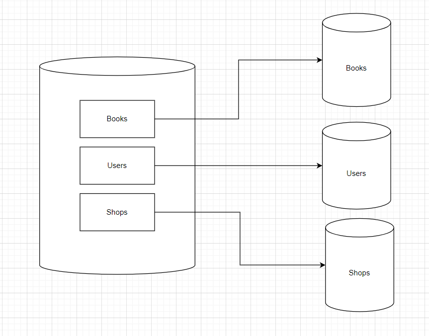

# Домашнее задание к занятию «Репликация и масштабирование. Часть 2»

Желаем успехов в выполнении домашнего задания.

---

### Задание 1

Опишите основные преимущества использования масштабирования методами:

- активный master-сервер и пассивный репликационный slave-сервер; 
- master-сервер и несколько slave-серверов;
- активный сервер со специальным механизмом репликации — distributed replicated block device (DRBD);
- SAN-кластер.

*Дайте ответ в свободной форме.*

такие виды масштабирования позволяют увеличивать пространство до бесконечности, так же есть возможность использовать недерогое железо. При горизонтальном масштабировании можно распределить нагрузку равномерно и нет необходимости в миграции инфраструктуры

---

### Задание 2

Разработайте план для выполнения горизонтального и вертикального шаринга базы данных. База данных состоит из трёх таблиц: 

- пользователи, 
- книги, 
- магазины (столбцы произвольно). 

Опишите принципы построения системы и их разграничение или разбивку между базами данных.

*Пришлите блоксхему, где и что будет располагаться. Опишите, в каких режимах будут работать сервера.* 

Горизонтальное масштабирование:

- пользователи - можно разбить по алфавиту или по дате регистрации, 
- книги - разбиваем по году написания книги, 
- магазины (столбцы произвольно) - вряд ли их будет так много что потребует шаринга

Вертикальное масштабирование:

Разобьем базу по таблицам, то есть все что касается пользователей будет лежать на одном сервере, книги на другом и тд

## Дополнительные задания (со звёздочкой*)
Эти задания дополнительные, то есть не обязательные к выполнению, и никак не повлияют на получение вами зачёта по этому домашнему заданию. Вы можете их выполнить, если хотите глубже шире разобраться в материале.

---
### Задание 3*

Выполните настройку выбранных методов шардинга из задания 2.

*Пришлите конфиг Docker и SQL скрипт с командами для базы данных*.
