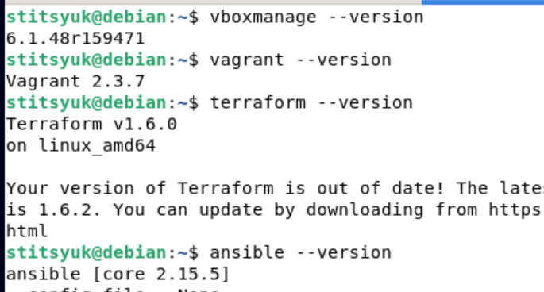
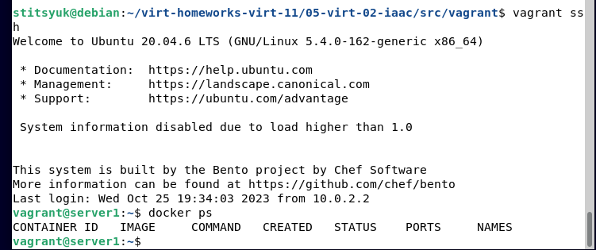

# Домашнее задание к занятию 2. «Применение принципов IaaC в работе с виртуальными машинами»

---

## Важно

https://github.com/netology-code/devops-materials 

https://www.youtube.com/watch?v=a0SFpItiGcc

---

## Задача 1

- Опишите основные преимущества применения на практике IaaC-паттернов.

    - экономит время
    - Стабильность среды, устранение дрейфа конфигураци
    - Ускорение производства и вывода продукта на рынок за счет автоматизации

- Какой из принципов IaaC является основополагающим?

    Идемпотентность

## Задача 2

- Чем Ansible выгодно отличается от других систем управление конфигурациями?

    Ansible не требует наличия агента на клиенте.
    Можно использовать в существующем  ssh соединении, т.е. не требует другого соединения.

- Какой, на ваш взгляд, метод работы систем конфигурации более надёжный — push или pull?

    pull

## Задача 3

Установите на личный компьютер:

- [VirtualBox](https://www.virtualbox.org/),
- [Vagrant](https://github.com/netology-code/devops-materials),
- [Terraform](https://github.com/netology-code/devops-materials/blob/master/README.md),
- Ansible.

*Приложите вывод команд установленных версий каждой из программ, оформленный в Markdown.*



## Задача 4 

Воспроизведите практическую часть лекции самостоятельно.

- Создайте виртуальную машину.
- Зайдите внутрь ВМ, убедитесь, что Docker установлен с помощью команды
```
docker ps,
```
Vagrantfile из лекции и код ansible находятся в [папке](https://github.com/netology-code/virt-homeworks/tree/virt-11/05-virt-02-iaac/src).

Примечание. Если Vagrant выдаёт ошибку:
```
URL: ["https://vagrantcloud.com/bento/ubuntu-20.04"]     
Error: The requested URL returned error: 404:
```

выполните следующие действия:

1. Скачайте с [сайта](https://app.vagrantup.com/bento/boxes/ubuntu-20.04) файл-образ "bento/ubuntu-20.04".
2. Добавьте его в список образов Vagrant: "vagrant box add bento/ubuntu-20.04 <путь к файлу>".

*Приложите скриншоты в качестве решения на эту задачу.*


